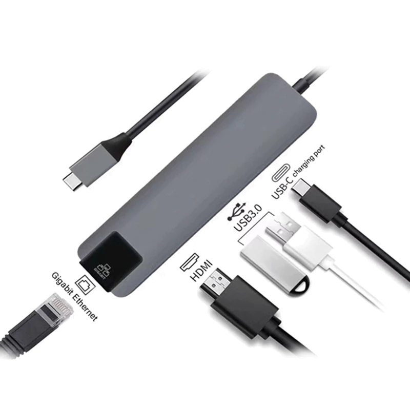
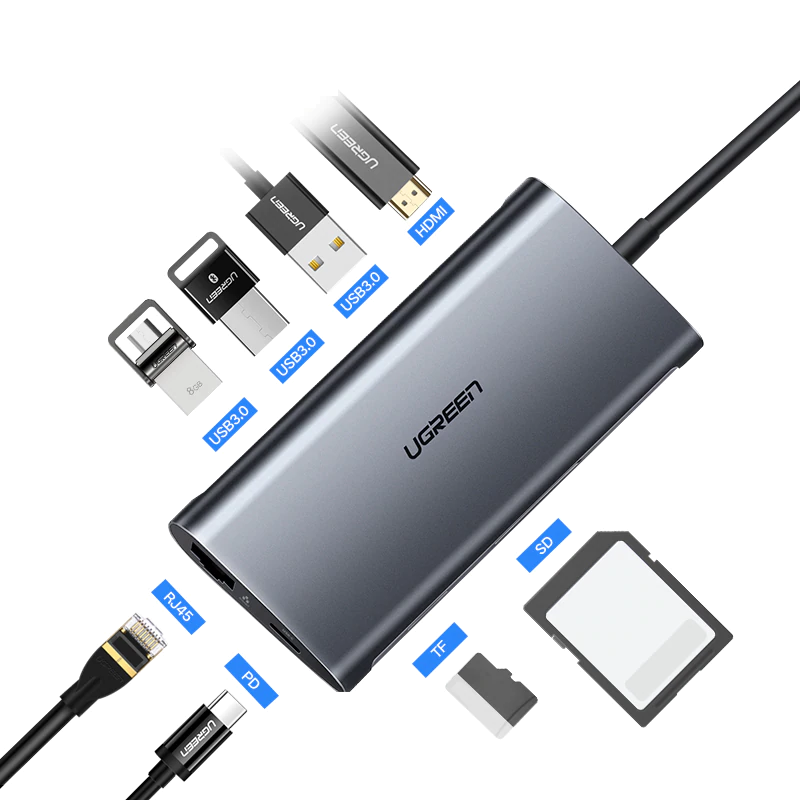

USB type c is the most recent USB standard, known also as 'Thunderbolt 3' for Apple products.

## Portable USB C Hub

This hub converts USB C (Thunderbolt 3) ports to:

- USB 3.0 (regular 'flat' usb)
- HDMI 4k (for displays)
- Ethernet, Gigabit LAN port (internet cable)

[Buy Now]( https://www.aliexpress.com/item/hot-5-in-1-USB-Type-C-Hub-Hdmi-4K-USB-C-Hub-to-Gigabit-Ethernet/32954358411.html )

---

## Extreme 8 in 1 adapter

This adapter converts the USB C port to:

- USB 3.0 (regular 'flat' usb)
- HDMI (for displays)
- SD card
- Micro SD card
- Ethernet, Gigabit LAN port (internet cable)

[Buy Now]( https://www.aliexpress.com/item/Ugreen-All-in-1-USB-C-HUB-with-Type-C-PD-Power-4K-Video-HDMI-SD/32821301992.html )

<!-- Global site tag (gtag.js) - Google Analytics -->

